### Interview-friendly explanation for Terraform

              Terraform is an open-source Infrastructure as Code (IaC) tool that lets you define and manage your cloud resources—like servers, databases, and networks—using simple configuration files. Instead of clicking around in the cloud console, you write code, and Terraform automatically creates, updates, or deletes resources to match that code. It works with multiple cloud providers (AWS, Azure, GCP, etc.) and keeps track of your infrastructure state so changes are predictable and repeatable.

                                  OR

              Think of Terraform like a blueprint for your cloud setup. You describe what you want—like 'I need 2 servers and a database'—and Terraform talks to the cloud and builds it for you. If you later change the blueprint, Terraform updates the real setup to match it.

---

#### Terraform init

`terraform init` initializes a Terraform working directory by installing the required provider plugins, setting up the backend for storing state files, and preparing modules. It ensures Terraform has the necessary binaries and configuration to manage infrastructure according to the `.tf` files in the directory.

**Key points (interview-safe):**

- Initializes the project.
- Downloads required providers (plugins that talk to cloud services).
- Prepares modules (reusable code blocks).
- Creates the hidden .terraform folder where all this setup is stored.

**Points to highlight:**

1. **Provider Installation** – Downloads provider binaries (e.g., AWS, Azure, GCP) specified in the configuration.
2. **Module Initialization** – Fetches any referenced modules from local paths or remote sources (Git, Terraform Registry, etc.).
3. **Backend Configuration** – Sets up where Terraform state will be stored (local or remote, e.g., S3, GCS, etc.).
4. **Workspace Setup** – Prepares the `.terraform` directory for state and cache files.
5. **Dependency Lock File** – Creates/updates `terraform.lock.hcl` to ensure consistent provider versions across environments.

💡 **In short:** It sets up the working directory by downloading the required providers (like AWS, Azure, GCP), installing modules, and getting everything ready to run Terraform commands."

---

#### Terraform plan

`terraform plan` shows you what changes Terraform will make before actually applying them. It compares your configuration files with the current state and gives a preview of resources to be created, updated, or destroyed.

**Analogy:**
It’s like reviewing a shopping list before going to the store—terraform plan shows what will be added, changed, or removed, but doesn’t actually do the shopping.

**Key points (interview-friendly):**

- It’s a dry run (no real changes happen).
- Compares desired state (your .tf code) with current state (infra already running).
- Outputs an execution plan (like a preview).
- Helps avoid mistakes before running terraform apply.

---

#### Terraform apply

`terraform apply` actually makes the changes to your cloud. It takes the plan created by Terraform, then creates, updates, or deletes resources so that your real infrastructure matches your code.

**Analogy:**
If `terraform plan` is like previewing a shopping list, `terraform apply` is actually going to the store and buying those items.

**Key points (interview-safe):**

- Executes the changes shown in terraform plan.
- Provisions, updates, or destroys resources in the cloud.
- Asks for confirmation before applying (unless -auto-approve is used).
- Updates the Terraform state file after changes are applied.

---

#### Terraform destroy

`terraform destroy` removes all the resources that Terraform created, tearing down the infrastructure defined in your code.

**Analogy:**
If `terraform apply` is building a house from a blueprint, `terraform destroy` is demolishing that house and clearing the land.

**Key points (interview-safe):**

- Deletes all resources managed by Terraform.
- Useful for cleaning up test or demo environments.
- Updates the state file after destroying resources.
- Asks for confirmation before deleting (unless-auto-approve is used).

---

#### Terraform Command Lifecycle (for Interviews)

| Command                 | Purpose (Simple)   | Purpose (Technical)                                                                                                       |
| ----------------------- | ------------------ | ------------------------------------------------------------------------------------------------------------------------- |
| **`terraform init`**    | Get tools ready    | Downloads provider plugins, configures backend, fetches modules, creates `.terraform` directory and `terraform.lock.hcl`. |
| **`terraform plan`**    | Preview changes    | Creates an execution plan showing what will be created, updated, or destroyed, based on `.tf` code vs. current state.     |
| **`terraform apply`**   | Build/update infra | Executes the plan to provision/update resources in the target cloud environment.                                          |
| **`terraform destroy`** | Tear down infra    | Destroys all managed resources defined in the Terraform state.                                                            |

**Analogy for interviews (easy + technical):**

- init = Setting up the toolbox 🧰
- plan = Drawing the blueprint 📐
- apply = Building as per blueprint 🏗️
- destroy = Demolishing the setup 🛠️

---

**Mermaid diagram you can use to visually explain the Terraform lifecycle (init → plan → apply → destroy) in an interview:**

```mermaid
flowchart LR
    A[terraform init <br> sets up providers, backend, and modules 🧰] --> B[terraform plan <br> shows a preview of what will change 📋
] --> C[terraform apply <br> creates/updates the infrastructure 🏗️
] --> D[terraform destroy <br> removes everything Terraform built 🛠️]

    A:::init
    B:::plan
    C:::apply
    D:::destroy

    classDef init fill:#f0f9ff,stroke:#0284c7,stroke-width:2px,color:#000,rx:10,ry:10
    classDef plan fill:#ecfdf5,stroke:#059669,stroke-width:2px,color:#000,rx:10,ry:10
    classDef apply fill:#fef9c3,stroke:#ca8a04,stroke-width:2px,color:#000,rx:10,ry:10
    classDef destroy fill:#fee2e2,stroke:#dc2626,stroke-width:2px,color:#000,rx:10,ry:10
```

**How to explain with this diagram:**

- `terraform init` → sets up providers, backend, and modules 🧰

- `terraform plan` → shows a preview of what will change 📋

- `terraform apply` → creates/updates the infrastructure 🏗️

- `terraform destroy` → removes everything Terraform built 🛠️

---

