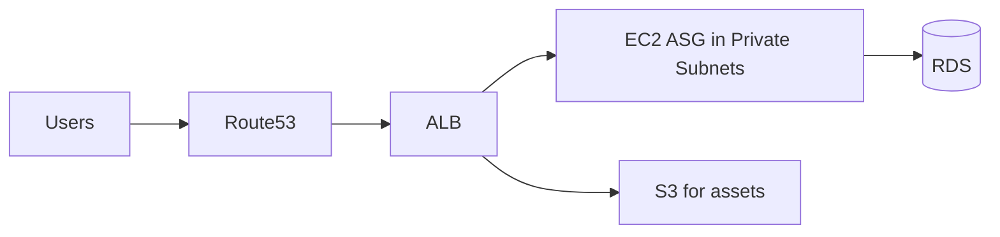
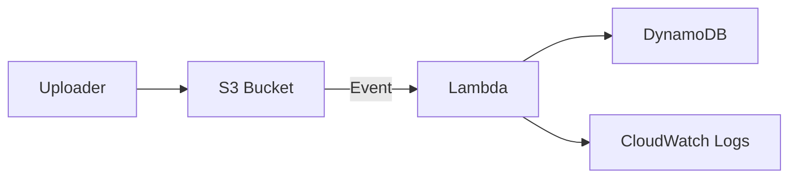

### Terraform Scenario-Based Interview Q\&A (AWS Focus)

#### 1. **Scenario: Setting up Infrastructure for a Web Application**

**Q:** You are asked to deploy a highly available web application on AWS using Terraform. How would you approach it?

**A:**

* I would first design the architecture (VPC, subnets, EC2/ECS/EKS, ALB, RDS, S3).
* In Terraform, I’d create reusable **modules** (e.g., VPC module, EC2 module, RDS module).
* Example:

  * **VPC module** → defines subnets, route tables, gateways.
  * **EC2 module** → launches app servers.
  * **RDS module** → sets up the database.
* I’d use **terraform.tfvars** to parameterize environment differences (dev, staging, prod).
* Finally, use `terraform plan` → review changes → `terraform apply`.

**Day-to-day activity example:** Updating instance size in `variables.tf` and running `terraform apply` to scale up production.


#### 2. **Scenario: Managing State**

**Q:** Your team is working on the same Terraform project. How do you handle state file conflicts?

**A:**

* I use **Terraform remote state backend** (S3 + DynamoDB for state locking).
* Example:

  ```hcl
  backend "s3" {
    bucket         = "terraform-states"
    key            = "prod/vpc/terraform.tfstate"
    region         = "us-east-1"
    dynamodb_table = "terraform-lock"
  }
  ```
* This ensures only one person can run `terraform apply` at a time.

**Day-to-day activity example:** When two developers try to apply changes, DynamoDB prevents conflicts by locking the state.

#### 3. **Scenario: Infrastructure Drift**

**Q:** Someone modified an AWS resource manually (outside Terraform). How do you detect and fix it?

**A:**

* I run `terraform plan`. It will show **drift** (difference between Terraform state and AWS actual infra).
* Then I either:

  * Import the resource using `terraform import` if I want to bring it under Terraform.
  * Or, if it’s unwanted, re-apply Terraform to bring it back to the desired state.

**Example:** A security group rule was added manually in AWS console → Terraform plan shows drift → I either add it to code or remove it via Terraform.

#### 4. **Scenario: CI/CD Pipeline**

**Q:** How do you integrate Terraform into a CI/CD pipeline for AWS?

**A:**

* I use **GitHub Actions** or **Jenkins** to automate Terraform.
* Typical flow:

  1. `terraform init`
  2. `terraform validate`
  3. `terraform plan` → save plan as artifact
  4. Manual approval
  5. `terraform apply`
* This ensures infra changes are reviewed before applying.

**Day-to-day activity example:** Developer raises PR → pipeline runs Terraform plan → team reviews → approved → pipeline applies infra changes in AWS.

#### 5. **Scenario: Cost Optimization**

**Q:** Your AWS bill is high. How do you use Terraform to optimize costs?

**A:**

* Use variables to **define instance types, auto-scaling, and lifecycle policies**.
* Example: Move from `m5.large` to `t3.medium`.
* Use `aws_s3_bucket_lifecycle_configuration` to transition old logs to Glacier.

**Example:** In project, we reduced costs by defining `count` on EC2 instances and enabling `ASG` with Terraform.

#### 6. **Scenario: Multi-Environment Setup**

**Q:** How do you manage dev, staging, and prod environments in Terraform?

**A:**

* I use **workspaces** (`terraform workspace new dev`) OR directory structure (`/env/dev`, `/env/prod`).
* Example:

  * `variables-dev.tfvars` → small instance sizes
  * `variables-prod.tfvars` → large instance sizes
* Pipeline picks the correct tfvars file for each environment.

**Day-to-day activity example:** Deploy new Lambda function in dev first, test it, then apply same Terraform in prod.

#### 7. **Scenario: Rolling Back Changes**

**Q:** What if a Terraform apply breaks production? How do you roll back?

**A:**

* Since Terraform is declarative, rollback means applying **previous known working version**.
* I use version control (Git) to checkout last commit and re-apply.
* If state is corrupted → restore from **S3 state backup**.

**Example:** After deploying wrong security group rule, users lost access → rolled back to previous Git commit → `terraform apply` restored access.

#### 8. **Scenario: Sensitive Data Handling**

**Q:** How do you handle secrets like DB passwords in Terraform?

**A:**

* Never hardcode passwords in `.tf` files.
* Use AWS Secrets Manager / SSM Parameter Store with Terraform.
* Example:

  ```hcl
  data "aws_ssm_parameter" "db_password" {
    name = "/prod/db/password"
    with_decryption = true
  }
  ```
* Reference: `password = data.aws_ssm_parameter.db_password.value`

**Day-to-day activity example:** Updating DB password in SSM, Terraform automatically fetches latest password.

#### 9. **Scenario: Module Reusability**

**Q:** How do you reuse infrastructure code in Terraform across multiple projects?

**A:**

* I create **Terraform modules**. Example:

  * `modules/vpc`
  * `modules/ec2`
* Then call them in different projects:

  ```hcl
  module "app_vpc" {
    source = "../modules/vpc"
    cidr_block = "10.0.0.0/16"
  }
  ```

**Day-to-day activity example:** Same VPC module used across dev/stage/prod, only variables differ.

#### 10. **Scenario: Real-World Example (Patient + Appointment Microservices on AWS Lambda – like your project)**

**Q:** Can you explain a real-time project where you used Terraform with AWS?

**A:**

* Project: Healthcare system with **Patient-service** and **Appointment-service** using AWS Lambda.
* Used Terraform to:

  * Deploy Lambda functions (Node.js containers).
  * API Gateway for routing requests.
  * DynamoDB for patient records.
  * S3 for static files (medical reports).
  * CloudWatch for monitoring.
* Automated deployment using GitHub Actions (Terraform in pipeline).

**Day-to-day activity example:** Updated Lambda memory from 256 MB → 512 MB in `variables.tf` and applied it, improving performance.

---

### Terraform Scenario Q\&A (AWS)

#### A. Basics & Core Workflow

**1) Q:** How do you structure a new Terraform project for an AWS app?

**A:**

* Create `/modules` for reusable parts (vpc, sg, ec2, rds), `/envs/{dev,prod}` for per-env.
* Keep providers and backends in root; variables/outputs in each module.

```hcl
# providers.tf
terraform { required_version = ">= 1.6.0" }
provider "aws" { region = var.region }
```

**2) Q:** What’s a typical init→plan→apply flow and why?

**A:**

* `init` downloads providers & configures backend, `plan` shows delta, `apply` enforces desired state.
* Commit code; never apply from untracked local changes.

**3) Q:** How do you pass environment-specific values?

**A:**

* Use `*.tfvars` per env or workspaces.

```bash
terraform apply -var-file=envs/dev.tfvars
```

**4) Q:** How do you avoid hardcoding AMI IDs?

**A:**

* Use `aws_ami` data source with filters.

```hcl
data "aws_ami" "linux" {
  most_recent = true
  owners = ["amazon"]
  filter { name = "name"; values = ["al2023-ami-*-x86_64"] }
}
```

**5) Q:** How do you share variables across modules?

**A:**

* Input vars in module; outputs from module to root.

```hcl
module "vpc" { source = "./modules/vpc" cidr_block = var.vpc_cidr }
output "vpc_id" { value = module.vpc.vpc_id }
```

---

#### B. State Management & Drift

**6) Q:** How do you set up remote state with locking?

**A:**

* S3 backend + DynamoDB table.

```hcl
terraform {
  backend "s3" {
    bucket="tf-states" key="prod/network.tfstate" region="us-east-1" dynamodb_table="tf-locks"
  }
}
```

**7) Q:** You see a state lock error. What do you do?

**A:**

* Check if another apply is running; if not, remove stale lock from DynamoDB cautiously (or `force-unlock`).

**8) Q:** How do you import an existing, manually-created resource?

**A:**

* Define resource in code, then `terraform import`.

```bash
terraform import aws_s3_bucket.logs my-logs-bucket
```

**9) Q:** How do you detect & fix drift?

**A:**

* `terraform plan` highlights drift; either codify missing config or re-apply to overwrite manual changes.

**10) Q:** How do you split state for big stacks?

**A:**

* Use multiple root modules/workspaces per domain (network, data, app) to reduce blast radius.

---

#### C. Modules & Reuse

**11) Q:** What makes a good Terraform module?

**A:**

* Single responsibility, minimal required inputs, clear outputs, sensible defaults, versioned releases.

**12) Q:** How do you version internal modules?

**A:**

* Use Git tags and `source = "git::ssh://...//modules/vpc?ref=v1.3.0"` to pin versions.

**13) Q:** How do you publish reusable modules for your org?

**A:**

* Private registry or Git monorepo with clear docs, examples, semantic versioning.

**14) Q:** How do you conditionally create resources in a module?

**A:**

* Use `count` or `for_each`.

```hcl
resource "aws_eip" "nat" { count = var.enable_nat ? 1 : 0 }
```

**15) Q:** How do you avoid cyclic dependencies between modules?

**A:**

* Keep cross-module outputs minimal, or separate stacks (e.g., network first, then app consumes outputs).

---

#### D. Multi-Env & Workspaces

**16) Q:** Workspaces vs separate folders?

**A:**

* Workspaces are simple for parameter changes; folders are clearer when infra differs per env or teams.

**17) Q:** How to use workspaces cleanly?

**A:**

```bash
terraform workspace new staging
terraform apply -var="env=staging"
```

* Reference with `terraform.workspace` in naming.

**18) Q:** How do you prevent prod mis-applies with workspaces?

**A:**

* CI gates: allow `apply` to prod only on tagged releases + manual approval; validate `terraform.workspace == "prod"`.

**19) Q:** Different regions per env?

**A:**

* Parameterize provider region via tfvars/workspaces; avoid multiple providers in one workspace unless needed.

**20) Q:** Share VPC outputs from `network` stack to `app` stack?

**A:**

* Use remote state data source.

```hcl
data "terraform_remote_state" "net" {
  backend="s3"
  config={ bucket="tf-states" key="prod/network.tfstate" region="us-east-1" }
}
```

---

#### E. CI/CD Integration

**21) Q:** Typical GitHub Actions pipeline for Terraform?

**A:**

* Jobs: fmt→validate→tflint→plan (PR) → apply (main, with approval).

```yaml
- run: terraform fmt -check
- run: terraform validate
- run: terraform plan -out=plan.out
```

**22) Q:** How do you store plan artifacts for approval?

**A:**

* Upload `plan.out` as artifact; require “Environment Protection Rules” for `apply`.

**23) Q:** Canary infra changes?

**A:**

* Apply to `dev` first from same code; run integration tests; promote tag → `staging` → `prod`.

**24) Q:** Secrets in CI?

**A:**

* Use OIDC federated role to AWS (no long-lived keys). Limit permissions by repo & env.

**25) Q:** Auto-destroy ephemeral environments for PRs?

**A:**

* On PR open → create workspace & apply; on close/merge → destroy & delete workspace.

---

#### F. Security & Compliance

**26) Q:** How do you manage secrets?

**A:**

* AWS SSM/Secrets Manager; `with_decryption = true`. Never commit secrets.

```hcl
data "aws_ssm_parameter" "db_pwd" { name="/prod/db/pwd" with_decryption=true }
```

**27) Q:** Enforce encryption at rest for S3?

**A:**

```hcl
resource "aws_s3_bucket_server_side_encryption_configuration" "this" {
  bucket = aws_s3_bucket.b.id
  rule { apply_server_side_encryption_by_default { sse_algorithm = "AES256" } }
}
```

**28) Q:** Restrict security groups to least privilege?

**A:**

* Parameterize allowed CIDRs/ports; deny all by default; review via `tflint` & policy as code.

**29) Q:** How to enforce org policies automatically?

**A:**

* OPA/Conftest or Terraform Cloud/Enterprise Sentinel policies (e.g., disallow public S3, require tags).

**30) Q:** Rotate access keys with Terraform?

**A:**

* Prefer roles; if keys necessary, manage lifecycle and alerting outside state (avoid storing secrets in state).

---

#### G. Cost Optimization & Scaling

**31) Q:** Cut EC2 costs via Terraform?

**A:**

* Right-size instance types, ASG min/max, Spot where appropriate, turn off non-prod by schedules (EventBridge + Lambda).

**32) Q:** Optimize S3 storage?

**A:**

* Lifecycle rules to IA/Glacier, intelligent-tiering for logs.

```hcl
resource "aws_s3_bucket_lifecycle_configuration" "logs" {
  bucket = aws_s3_bucket.logs.id
  rule {
    id="log-tier"
    filter {}
    transition { days=30 storage_class="STANDARD_IA" }
    transition { days=90 storage_class="GLACIER" }
    status="Enabled"
  }
}
```

**33) Q:** EKS cost levers via Terraform?

**A:**

* Managed node groups with right instance mix, cluster-autoscaler, Spot pools, HPA at app layer (helm\_release).

**34) Q:** RDS savings?

**A:**

* Use `storage_autoscaling`, `multi_az` only where needed, right engine versions, and reserved instances where stable.

**35) Q:** Showback tags for cost allocation?

**A:**

* Enforce common tags in modules: `Environment`, `Owner`, `CostCenter`. Fail plan if missing.

---

#### H. Real-World AWS Project Scenarios

**36) Q:** API Gateway + Lambda (Node.js) microservices?

**A:**

* One module per service; deploy via container images (ECR).

```hcl
resource "aws_lambda_function" "svc" {
  function_name = "patient-svc"
  package_type  = "Image"
  image_uri     = "${aws_ecr_repository.repo.repository_url}:v1.2.0"
  role          = aws_iam_role.lambda.arn
  memory_size   = 512
}
```

**37) Q:** Event-driven pipeline S3→Lambda→DynamoDB?

**A:**

* S3 event notification to Lambda; Lambda writes to DynamoDB; permissions via IAM policy attachments.

**38) Q:** Blue/Green for ECS?

**A:**

* Use CodeDeploy with ECS; Terraform defines `aws_codedeploy_app` + `deployment_group`.

**39) Q:** Multi-AZ ALB + ASG web tier with HTTPS?

**A:**

* ACM cert + ALB listener 443; ASG spread across subnets; SGs restrict 80→443 only from ALB.

**40) Q:** Centralized logging?

**A:**

* VPC flow logs to CloudWatch/S3, ALB access logs to S3, Lambda logs to CW; bucket lifecycle rules.

**41) Q:** CloudFront + S3 static SPA with OAC?

**A:**

* Lock bucket public access; use Origin Access Control; cache policies via Terraform.

**42) Q:** VPC with Private Subnets + NAT?

**A:**

* One NAT per AZ (cost ↑) or shared NAT (cost ↓, resiliency ↓). Parameterize.

**43) Q:** Private RDS with app in ECS?

**A:**

* Place RDS in private subnets; SG allow from ECS SG only; no public access; secrets via SSM.

**44) Q:** Batch ETL with Step Functions?

**A:**

* Terraform `aws_sfn_state_machine` + Lambda/ECS tasks; IAM roles per state.

**45) Q:** KMS strategy?

**A:**

* Customer managed keys per domain; key policies least privilege; enable rotation; alias naming standard.

---

#### I. Day-to-Day Ops

**46) Q:** Safe parameter change (e.g., instance size) in prod?

**A:**

* PR → plan in staging → integration tests → approval → apply to prod; monitor CloudWatch.

**47) Q:** Add a new intra-VPC SG rule urgently?

**A:**

* Temporary change via PR with expiry note; add ticket to revert; avoid console-only changes.

**48) Q:** Rollback after bad apply?

**A:**

* Revert to last known good commit; `plan` & `apply`; use S3 state versioning if state corruption suspected.

**49) Q:** How to document infra automatically?

**A:**

* `terraform graph` + tools; keep README per module with inputs/outputs; tag resources consistently.

**50) Q:** Handle provider upgrades?

**A:**

* Pin versions, test in dev; read provider CHANGELOG; run `terraform state mv` / `migrate` if resources renamed.

---

#### J. Troubleshooting & Best Practices

**51) Q:** `Error acquiring state lock` keeps happening.

**A:**

* Ensure CI isn’t running parallel applies; consolidate pipelines; check DynamoDB TTL & lock table capacity.

**52) Q:** Terraform wants to replace an RDS in plan unexpectedly.

**A:**

* Inspect attributes marked `ForceNew` (e.g., storage type/engine). Split to separate change windows or use snapshot + restore plan.

**53) Q:** Prevent accidental destroy of critical resources.

**A:**

* `lifecycle { prevent_destroy = true }` and Sentinel/OPA policies.

```hcl
resource "aws_kms_key" "cmk" {
  description="prod-cmk"
  lifecycle { prevent_destroy = true }
}
```

**54) Q:** Speed up slow plans on big stacks.

**A:**

* Break into smaller root modules; cache provider plugins in CI; use `-refresh=false` if safe for quick diffs.

**55) Q:** Enforce tagging everywhere.

**A:**

* Module wrapper with `merge(var.tags, { Environment = var.env })`; policy checks in CI to fail when tags missing.

---

### Quick Diagrams (for mental model)

**Web App (ALB → ASG → RDS)**



**Serverless Ingest (S3 → Lambda → DynamoDB)**



---

#### Handy Snippet Pack

**Common Tags Pattern**

```hcl
variable "tags" { type = map(string) default = {} }
locals { common_tags = merge({ Project="HealthApp", ManagedBy="Terraform" }, var.tags) }
resource "aws_s3_bucket" "b" { bucket="app-${var.env}-assets" tags = local.common_tags }
```

**ALB + HTTPS Listener**

```hcl
resource "aws_lb_listener" "https" {
  load_balancer_arn = aws_lb.app.arn
  port = 443
  protocol = "HTTPS"
  ssl_policy = "ELBSecurityPolicy-TLS13-1-2-2021-06"
  certificate_arn = aws_acm_certificate.cert.arn
  default_action { type="forward" target_group_arn = aws_lb_target_group.app.arn }
}
```

**Remote State Consumption**

```hcl
data "terraform_remote_state" "net" {
  backend = "s3"
  config  = { bucket = "tf-states", key = "prod/network.tfstate", region = "us-east-1" }
}
resource "aws_subnet" "app" {
  vpc_id = data.terraform_remote_state.net.outputs.vpc_id
  # ...
}
```

