```mermaid
graph TD

    A[Terraform CLI Commands] --> B[Core Lifecycle]
    A --> C[Validation & Formatting]
    A --> D[State Management]
    A --> E[Workspaces & Env]
    A --> F[Providers]
    A --> G[Advanced/Utility]

    %% Core lifecycle
    B --> B1[terraform init]
    B --> B2[terraform validate]
    B --> B3[terraform plan]
    B --> B4[terraform apply]
    B --> B5[terraform destroy]

    %% Validation & Formatting
    C --> C1[terraform fmt]
    C --> C2[terraform validate]

    %% State Management
    D --> D1[terraform show]
    D --> D2[terraform state]
    D1 --> D11[show]
    D2 --> D21[list]
    D2 --> D22[show]
    D2 --> D23[rm]
    D2 --> D24[mv]

    %% Workspaces
    E --> E1[terraform workspace]
    E1 --> E11[list]
    E1 --> E12[new]
    E1 --> E13[select]
    E1 --> E14[show]
    E1 --> E15[delete]

    %% Providers
    F --> F1[terraform providers]
    F1 --> F11[schema]
    F1 --> F12[mirror]

    %% Advanced/Utility
    G --> G1[terraform version]
    G --> G2[terraform output]
    G --> G3[terraform import]
    G --> G4[terraform taint/untaint]
    G --> G5[terraform graph]
    G --> G6[terraform login/logout]
```

### **Terraform Commands with Examples**

---

#### 1. **`terraform init`** – Initialize a project

* Prepares the working directory.
* Downloads providers & modules.
* Sets up the backend.

```bash
terraform init 

# Child options:
terraform init -upgrade # → Upgrade providers/modules to the latest version.
terraform init -backend=false # → Skip backend setup.
terraform init -reconfigure # → Reinitialize backend ignoring old settings
```

#### 2. **`terraform validate`** – Validate configuration

* Checks `.tf` files for syntax & logical errors.
* Doesn’t talk to the provider API.

```bash
terraform validate

# Child options:
terraform validate -json # → Output validation results in JSON format.
```

#### 3. **`terraform plan`** – Preview execution plan


* Shows execution plan (preview changes).
* Compares desired vs. current state.
* Shows what Terraform *will do* without making changes.

```bash
terraform plan
# Child options:

terraform plan -out=tfplan # -out=planfile → Save the plan to a file.
terraform plan -var="instance_type=t2.micro" # -var / -var-file → Pass variables.
terraform plan -refresh=false # → Don’t refresh remote state before planning.
```

#### 4. **`terraform apply`** – Apply changes

Executes the plan to provision/update infrastructure.

```bash
terraform apply

# Child options
terraform apply -auto-approve # → Skip manual approval.
terraform apply tfplan(planfile)   # → Apply a previously saved plan(apply saved plan).
terraform apply -var / -var-file # → Pass variables.
```

#### 5. **`terraform destroy`** – Destroy infrastructure

Tears down resources created by Terraform. (or) Deletes all managed resources.

```bash
terraform destroy

# Child options:
terraform destroy -auto-approve # → Skip confirmation.
terraform destroy -target=aws_instance.my_ec2 # -target=resource → Destroy only a specific resource.
```

#### 6. **`terraform show`** – Show state or plan details

Displays current state or a saved plan file.

```bash
terraform show

# Child options:
terraform show tfplan
terraform show -json # → Show state in JSON format.
```

#### 7. **`terraform state`** – Manage state files

Inspect and modify Terraform state.
&nbsp; &nbsp; &nbsp; &nbsp; &nbsp; &nbsp; &nbsp; &nbsp; &nbsp; &nbsp; &nbsp; &nbsp; &nbsp; &nbsp; or
Manage and inspect Terraform state files.

```bash
terraform state list # → List resources in state.
terraform state show aws_instance.my_ec2 # → Show a specific resource.
terraform state rm aws_instance.my_ec2 # → Remove resource from state (doesn’t destroy it).
terraform state mv aws_instance.old aws_instance.new # → Move items within state.
```

#### 8. **`terraform fmt`** – Format configuration files

Auto-formats `.tf` files into standard style.

```bash
terraform fmt
terraform fmt -recursive # → Format all subdirectories.
```

#### 9. **`terraform output`** – Show output values

Displays outputs defined in configuration.

```bash
terraform output
terraform output -json # → Show outputs in JSON format.
terraform output instance_ip
```

#### 10. **`terraform providers`** – Show providers used

Lists providers used in configuration.

```bash
terraform providers
terraform providers mirror # → Copy providers to a local directory.
terraform providers schema # → Show provider schema.
```

#### 11. **`terraform workspace`** – Manage workspaces

Manages multiple workspaces.

Useful for multiple environments (dev, staging, prod).

Child commands:
* list → Show all workspaces.
* new → Create a new workspace.
* select → Switch workspace.
* delete → Delete a workspace.
* show → Show current workspace.

```bash
terraform workspace list
terraform workspace new dev
terraform workspace select dev
terraform workspace show
terraform workspace delete dev
```

#### 12. **`terraform version`** – Show version info

Shows Terraform version and installed providers.

```bash
terraform version
```

#### 13. **`terraform graph`** – Show dependency graph

Generates a visual graph of resource dependencies.

```bash
terraform graph | dot -Tpng > graph.png
```

#### 14. **`terraform login/logout`** – Terraform Cloud auth

```bash
terraform login # → Authenticate with Terraform Cloud.
terraform logout # → Remove saved credentials.
```

#### 15. **`terraform import`** – Import existing resource

Brings unmanaged resources into Terraform state.
<br> &nbsp; &nbsp; or <br>
Bring existing resources under Terraform management.
```bash
terraform import aws_instance.my_ec2 i-0abcd1234efgh5678
```


#### 16. **`terraform taint/untaint`** – Force recreation

```bash
terraform taint aws_instance.my_ec2 # → Mark a resource for recreation on next apply.
terraform untaint aws_instance.my_ec2 # → Remove taint mark.
```

---

**Terraform Lifecycle (core commands):**

`init → validate → plan → apply → destroy`

**Helper commands:**

`fmt`, `output`, `show`, `graph`, `version`

**State & environment commands:**

`state`, `workspace`, `providers`, `import`, `taint`

---


